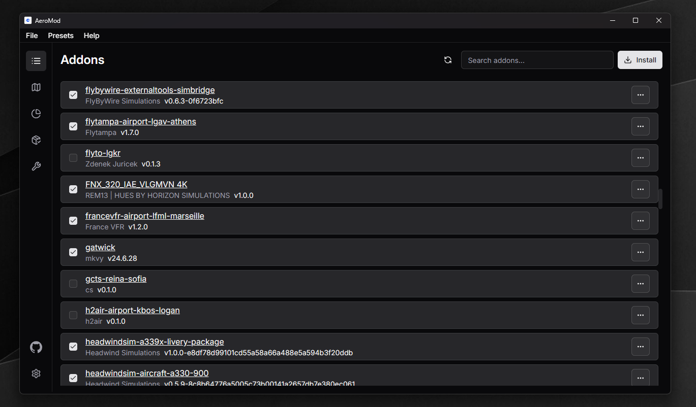

<div align="center">
  
  <h1 align="center"><b>AeroMod</b></h1>
  <p align="center">
		An external mod manager for Microsoft Flight Simulator.
    <br />
    <a href="https://flightsim.to/file/79373/aeromod"><strong>flightsim.to »</strong></a>
  </p>
</div>

<br/>



AeroMod is a lightweight, user-friendly addon manager built for
Microsoft Flight Simulator that lets you manager your addons effortlessly.

## Features

- ✅ **Enable / Disable Addons** – Instantly toggle addons on or off without moving files around.
- 📦 **Install / Uninstall Addons** – Seamlessly add or remove addons with just a few clicks.
- 🛠️ **Verify Addon Files** – Check for missing or corrupted files to ensure addon integrity.
- 🔍 **Search Addons** – Quickly find the addon you're looking for.
- 🧩 **View Addon Details** – See important info like type, author, and version.
- ⚙️ **Presets** – Create and manage addon presets for different flight scenarios.
- 🗺️ **Scenery Map** – Visualize your scenery addons on a map.

## How It Works

AeroMod uses symbolic links to manage addons. This approach offers several advantages:

- 🚀 **Better Performance** - No lengthy file copying operations.
- 🍃 **Disk Space Efficiency** - Addons are stored in one location, eliminating duplicates.
- 🛡️ **Safer Operation** - Original addon files remain untouched, preventing corruption.

## Development

AeroMod is a [Tauri](https://tauri.app) based application. Its frontend
is written in [React](https://react.dev) using [TypeScript](https://www.typescriptlang.org)
and its backend is written in [Rust](https://www.rust-lang.org).

### Prerequisites

In order to get started you’ll first need to install a few dependencies:

1. Tauri System Dependencies

Visit https://tauri.app/start/prerequisites/#system-dependencies to install
**Tauri System Dependencies**.

2. Rust

Visit https://www.rust-lang.org/tools/install to install **Rust**.

3. Node.js

Ensure you've got at least **Node.js 20** installed. Visit https://nodejs.org/en/download
to install **Node.js**.

4. pnpm

Use **corepack** to install **pnpm**:

```sh
cd aeromod
corepack enable
```

### Setup

Install project dependencies:

```sh
pnpm install
```

### Running Locally

Run the app in development mode:

```sh
pnpm tauri dev
```

### Lint & Format

TypeScript:

```sh
pnpm lint
pnpm format
```

Rust:

```sh
cargo clippy
cargo format
```

### Build

Create a production build:

```sh
pnpm tauri build
```

## License

Distributed under the GPL 3.0 License. See [LICENSE](LICENSE) for more information.
